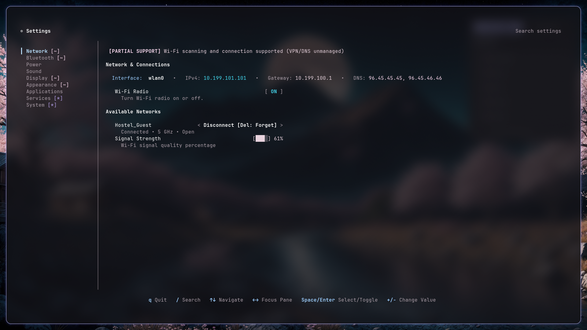

<div align="center">

# ⚙️ Settings TUI (`settings-tui`)

### The Missing Native Control Center for Linux Power Users

[](https://github.com/ziuus/settings-tui/actions/workflows/ci.yml)
[](https://www.npmjs.com/package/settings-tui)
[](LICENSE-MIT)
[](https://www.rust-lang.org)
[]()

<br/>



<br/>

**Stop juggling 10 different command-line utilities.**  
`settings-tui` brings the full functionality and polish of modern graphical control centers (GNOME Settings, KDE System Settings) straight to your terminal. Control your network, audio, displays, power, Bluetooth, systemd units, and desktop themes through a unified, keyboard-driven interface.

[Quick Start](#-quick-start) • [Why settings-tui?](#-why-settings-tui) • [Features](#-subsystem-breakdown) • [Keybindings](#-keyboard-navigation) • [Contributing](CONTRIBUTING.md)

</div>

---

## ⚡ Why settings-tui?

| Pain Point with Existing Setup | With `settings-tui` |
|---|---|
| Memorizing syntax for `nmcli`, `bluetoothctl`, `wpctl`, `brightnessctl`, `hyprctl`, and `systemctl` | **One unified TUI** covering all system settings |
| Heavy Electron apps or GNOME/KDE control centers requiring 500MB+ dependencies on minimal window managers | **Pure Rust binary** (<9 MB stripped), sub-15ms startup, zero desktop environment lock-in |
| Shell scripts that blindly run commands and assume they worked | **Transactional engine** (`READ -> MUTATE -> READBACK -> VERIFY`) ensuring state changes actually succeeded |
| Clunky network connection prompts popping up outside your terminal | **Interactive masked password dialogs**, Wi-Fi frequency & security inspection built-in |
| Hidden or broken features failing silently on different distros | **Transparent Capability Matrix** with honest badges (`[~]`, `[*]`, `[R]`) so you know what is supported |

---

## 🚀 Quick Start

### 1. Instant Run via npx (Zero Install)
You can launch `settings-tui` immediately without compiling:
```bash
npx settings-tui
```

### 2. Install Globally via npm
```bash
npm install -g settings-tui

# Launch anytime:
settings-tui
# Or simply:
settings
```

### 3. Build & Install from Source (Cargo)
```bash
git clone https://github.com/ziuus/settings-tui.git
cd settings-tui
cargo build --release
sudo make install
```

### 4. Arch Linux
```bash
cd extra && makepkg -si
```

---

## 🧩 Subsystem Breakdown

### 🌐 Network & Connections
* **Real-time Wi-Fi Scanner**: Live discovery of access points with signal quality bars (`[████] 84%`), frequency band detection (`5 GHz` vs `2.4 GHz`), and security tags (`WPA2/WPA3`, `WEP`, `Open`).
* **Interactive Password Modal**: Built-in credential prompt for secured networks with masked entry (`••••••••`), `Tab` show/hide toggle, and `Esc` cancel.
* **Active Connection Card**: Live network interface device, local IPv4, default gateway, and nameserver DNS addresses parsed from `/etc/resolv.conf`.
* **Profile Management**: Instant connect for open/saved networks, disconnect for active connections, and `Backspace`/`Delete` confirmation to forget saved Wi-Fi profiles.

### 🔋 Power & Battery Telemetry
* **Live Energy Analytics**: Visual charge meter with real-time battery level percentage.
* **Deep Hardware Metrics**: Power draw in Watts (`5.79 W`), factory design Wh vs full capacity Wh, cycle count, terminal voltage, and cell model identity.
* **Power Profiles**: Live switching between `performance`, `balanced`, and `power-saver` via `power-profiles-daemon`.
* **Time Estimates**: Calculated time-to-full during AC charging and time-to-empty while discharging.

### 🔊 Sound & Streams
* **PipeWire & WirePlumber Integration**: Fast output sinks and input sources discovery with default device selection.
* **Volume Sliders**: Granular volume controls (`0–100%`) with mute toggling via `Space`.
* **Per-Application Mixing**: Monitor and adjust audio volume individually for running applications playing or recording audio.

### 🖥️ Display & Backlight
* **Monitor Management**: Enumerates active monitors and primary display detection under Hyprland / Wayland.
* **Resolution & Refresh Rate**: Select and apply supported screen resolutions and refresh rates with display scale preservation.
* **Backlight Slider**: Seamless screen brightness adjustment via `brightnessctl` and sysfs fallback.

### 📱 Bluetooth
* **BlueZ D-Bus Engine**: Live adapter power toggle (`[ ON ]` / `[ OFF ]`).
* **Device Operations**: Connect, disconnect, and forget peripherals with confirmation modals.

### ⚙️ Services & System
* **systemd Management**: Inspect active/substate unit statuses and safely toggle units with Polkit elevation support.
* **Host & Disk Telemetry**: Kernel release, OS distro, hostname, chassis type, memory utilization (RAM used/total), and visual storage partition bars.
* **Network Time (NTP)**: Live toggleable network time synchronization via `systemd-timedated`.
* **Protected Power Actions**: Suspend, Hibernate, Reboot, and Power Off with explicit safety confirmation dialogs.

### 🎨 Appearance & Applications
* **Theme Switching**: Dark / Light color scheme toggle via XDG Desktop Portal / gsettings.
* **App Launcher**: Parses standard system and user `.desktop` entries and Flatpak installations with category filtering and background execution.

---

## ⌨️ Keyboard Navigation

Designed from the ground up for keyboard power users. Supports standard arrows and Vim navigation (`hjkl`):

| Key | Context | Action |
|---|---|---|
| `↑` / `k`, `↓` / `j` | Any | Navigate list items or sidebar categories |
| `←` / `h` | Content | Return focus to sidebar categories |
| `→` / `l` / `Enter` | Sidebar | Enter content view for the selected category |
| `Enter` | Content | Activate setting / connect / confirm / launch |
| `Space` | Content | Toggle switches / mute audio device |
| `+` / `-` or `>` / `<` | Content | Increase / decrease volume, brightness, or cycle power profiles |
| `Backspace` / `Del` | Content | Forget saved Wi-Fi profile or paired Bluetooth device |
| `/` | Any | Open global fuzzy search across all categories |
| `Tab` | Password Dialog | Toggle password visibility (show / hide plaintext) |
| `Esc` | Modal / Search | Dismiss dialog or exit search mode |
| `q` | Top-level | Clean exit (terminal state completely restored) |

---

## 🔍 Global Search

Press `/` from anywhere to initiate global search. Type keywords like `wifi`, `volume`, `brightness`, `dark`, `ntp`, `power`, or `reboot` and hit `Enter` to navigate directly to that exact setting:

```
⚙ Settings  / bright█
  Screen Brightness            Display      Display > Screen Brightness
  Keyboard Backlight           Display      Display > Backlight
```

---

## 🛠️ CLI Options & Diagnostics

```
settings-tui [OPTIONS]

Options:
  -s, --section <NAME>   Jump directly to category (Network, Bluetooth, Sound, Power, Display, Appearance, Applications, Services, System)
  -q, --search <QUERY>   Launch directly with search query active
  -d, --diagnose         Output the Linux compatibility and capability matrix and exit
  -c, --config <FILE>    Custom path to config [default: ~/.config/settings-tui/config.json]
  -h, --help             Print help information
  -V, --version          Print version information
```

### Self-Diagnostics
Run `settings-tui --diagnose` to view your system's native capability matrix:
```bash
$ settings-tui --diagnose
Checking Linux platform and backend capabilities...

  Desktop:       Hyprland
  Session Type:  wayland
  Compositor:    Hyprland
  Init System:   systemd
  Network:       Wi-Fi scanning and connection supported (VPN/DNS unmanaged)
  Bluetooth:     Power toggle and device connect/forget supported (PIN pairing unmanaged)
  Power:         Mutable (Full)
  Sound:         Mutable (Full)
  Display:       Resolution and refresh rate mutable via hyprctl (scaling read-only)
  Appearance:    Color scheme toggle supported (font and icon themes read-only)
  Services:      Service state mutations require Polkit elevation
  System:        Power actions require active logind session / Polkit
```

---

## 🤝 Contributing

Contributions are welcome! Please see [CONTRIBUTING.md](CONTRIBUTING.md) for architectural overview, coding standards, test suite guidelines, and local development setup.

For autonomous AI coding assistants, see [AGENTS.md](AGENTS.md) for architectural invariants, state patterns, and guidelines.

---

## 📄 License

This project is licensed under the [MIT License](LICENSE-MIT).
